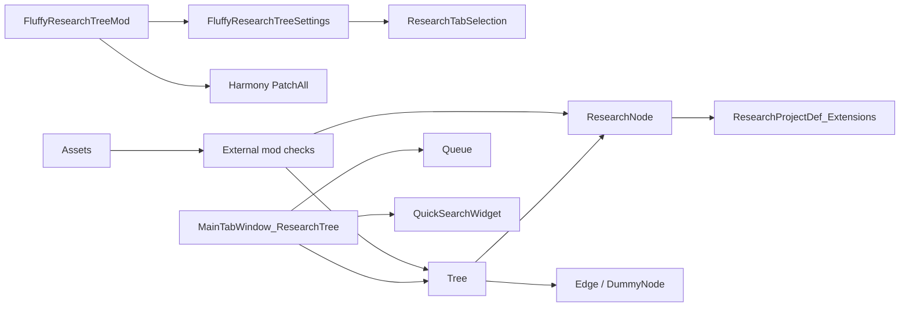

# Architecture MOC

## 核心结构

- [[Runtime Architecture]]：运行时层次、状态流和模块边界。
- [[Code Module Map]]：主要 C# 文件职责。
- [[Harmony Patch Surface]]：Harmony patch 与 XML Def patch 的注入面。
- [[Tree Generation]]：研究图构建管线。
- [[Research Queue]]：队列状态和保存加载。
- [[Compatibility]]：外部模组兼容注册和反射边界。

## 模块关系

## 关键边界

- `FluffyResearchTreeMod` 是启动和设置 UI 边界。
- `MainTabWindow_ResearchTree` 是 Unity/RimWorld UI 输入边界。
- `Tree` 是研究图数据和布局边界。
- `Queue` 是世界存档状态边界。
- `Assets` 是贴图、颜色、外部模组检测和反射兼容边界。
- `Patches/*` 是对 RimWorld 原版研究生命周期的注入边界。
