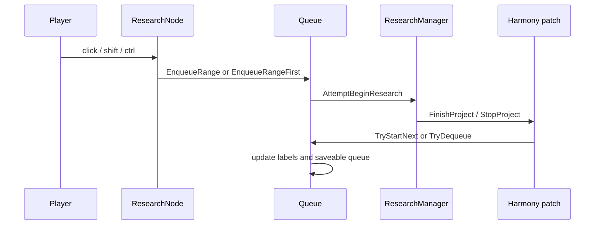

# Research Queue

`Queue` 是 `WorldComponent`，负责研究队列状态、保存加载、UI 标签绘制和研究完成后的自动推进。

## 核心文件

- `Source/ResearchTree/Queue.cs`
- `Source/ResearchTree/ResearchNode.cs`
- `Source/ResearchTree/Patches/ResearchManager_FinishProject.cs`
- `Source/ResearchTree/Patches/ResearchManager_StopProject.cs`
- `Source/ResearchTree/Patches/MainTabWindow_Research_DoBeginResearch.cs`
- `Source/ResearchTree/Patches/MainTabWindow_Research_AttemptBeginResearch.cs`

## 玩家操作

- 普通左键：按 `ReverseShift` 设置决定替换队列或追加队列。
- Shift + 左键：执行普通左键的反向语义。
- Ctrl + 左键：`EnqueueRangeFirst()`，把所选研究和缺失前置移动到队首。
- 拖拽队列条：重排队列。
- 完成当前研究：`TryStartNext()` 出队并启动下一项。

## 生命周期

## 持久化

- `ExposeData()` 在 Saving 时把 `_queue` 转成 `_saveableQueue`。
- PostLoadInit 时通过 `ResearchProjectDef.ResearchNode()` 恢复队列。
- `Notify_TreeWillReset()` / `Notify_TreeReinitialized()` 在树重建前后保留研究 Def 列表，避免节点对象失效。

> [!warning]
> 队列里保存的是研究 Def，运行时队列里是 `ResearchNode`。重建研究树时必须先备份 Def，再恢复到新节点。

## 相关笔记

- [[Tree Generation]]
- [[Harmony Patch Surface]]
- [[Verification Guide]]
