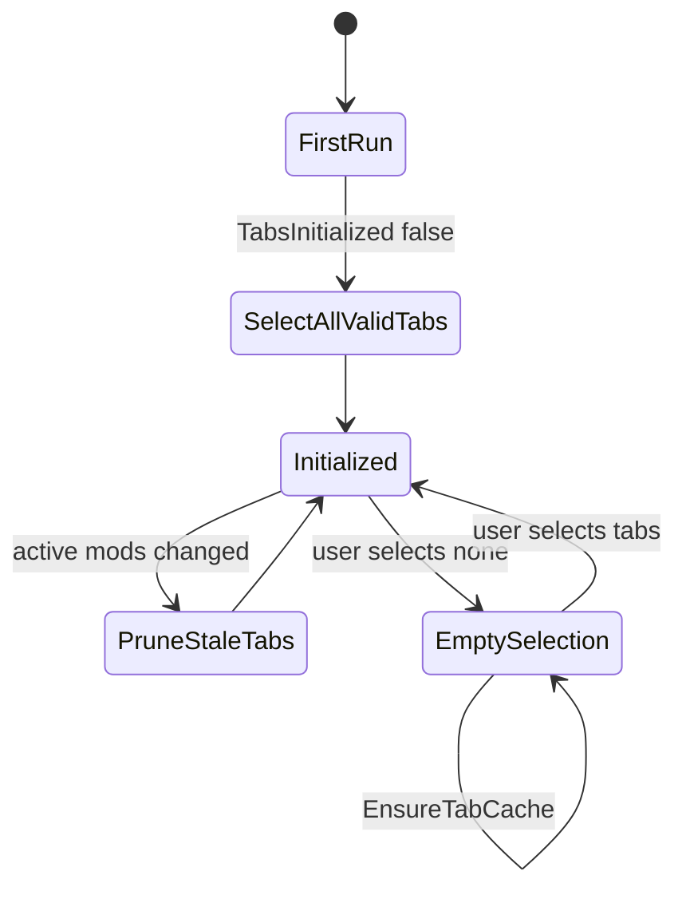

# Settings and Tab Filtering

设置由 `FluffyResearchTreeMod` 绘制，`FluffyResearchTreeSettings` 持久化，`ResearchTabSelection` 负责可单测的标签选择归一化。

## 核心文件

- `Source/ResearchTree/FluffyResearchTreeMod.cs`
- `Source/ResearchTree/FluffyResearchTreeSettings.cs`
- `Source/ResearchTree/Dialog_SelectResearchTabs.cs`
- `Source/ResearchTree/ResearchTabSelection.cs`
- `Source/ResearchTree.Tests/Program.cs`

## 设置项

- `LoadType`：后台加载、首次打开加载、不生成研究树。
- `OverrideResearch`：是否覆盖原版研究入口。
- `ReverseShift`：切换普通点击与 Shift 点击的队列语义。
- `PauseOnOpen`：打开窗口时暂停。
- `ShowCompletion`、`ShowResearchLines`：节点信息显示。
- `SkipCompleted`：隐藏已完成研究。
- `VisualGroupByTab`：按研究标签视觉分组。
- `IncludedTabs` / `TabsInitialized`：研究标签过滤状态。

## 标签过滤状态机

## 关键行为

- 首次运行时，所有当前有效研究标签默认被选中。
- 已卸载模组留下的旧 tab defName 会被剪枝。
- 用户主动全不选时，空集合必须保持为空，不能被当作“未配置”重新全选。
- 队列中的研究和前置链在树过滤时会被保留，避免队列断链。

> [!success]
> `ResearchTabSelection` 让标签选择规则脱离 RimWorld 运行时，可以通过普通 .NET 单测保护。

## 相关笔记

- [[Tree Generation]]
- [[Verification Guide]]
- [[Research Queue]]
