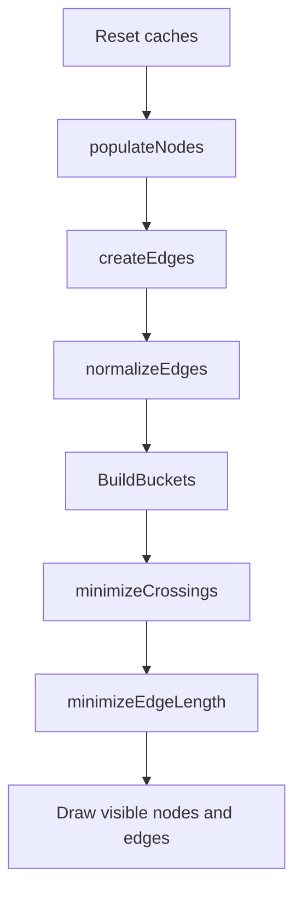

# Tree Generation

`Tree` 是研究图生成、布局、缓存、绘制的核心模块。

## 核心文件

- `Source/ResearchTree/Tree.cs`
- `Source/ResearchTree/Node.cs`
- `Source/ResearchTree/ResearchNode.cs`
- `Source/ResearchTree/DummyNode.cs`
- `Source/ResearchTree/Edge.cs`

## 初始化管线

`Tree.Initialize()` 的主路径：

1. `Reset(false)` 清理旧节点、边、缓存和窗口尺寸。
2. `populateNodes()` 从 `DefDatabase<ResearchProjectDef>` 创建 `ResearchNode`。
3. `createEdges()` 根据 prerequisite / hidden prerequisite 创建依赖边。
4. `normalizeEdges()` 使用 `DummyNode` 拆分跨层长边。
5. `BuildBuckets()` 建立层、边、槽位缓存。
6. `minimizeCrossings()` 降低边交叉。
7. `minimizeEdgeLength()` 缩短边长度。
8. `horizontalPositions()` 和后续绘制路径更新节点位置。

## 可见性规则

`populateNodes()` 会过滤：

- Anomaly `knowledgeCategory` 研究。
- 自引用 prerequisite 的隐藏研究。
- 被隐藏研究祖先链影响的研究。
- 未被当前标签选择包含的研究。

特殊保留：

- 已排队项目会被重新加入可见集合。
- 排队项目的 prerequisite / hidden prerequisite 会递归加入可见集合，避免队列断链。

## 性能边界

- `Tree.Draw(Rect visibleRect)` 只绘制可见层、可见行和已收集的可见边。
- `_layerBuckets`、`_inEdgesPerLayer`、`_outEdgesPerLayer`、`_layerSlots` 是热路径缓存。
- `CollapsedEdge` 用于减少多段边绘制成本。

> [!note]
> 这里的布局算法是核心玩法资产。清理时优先删除噪声和收窄缓存失效点，不要轻易改排序/交换算法。

## 相关笔记

- [[Runtime Architecture]]
- [[Search and Node Interaction]]
- [[Settings and Tab Filtering]]
