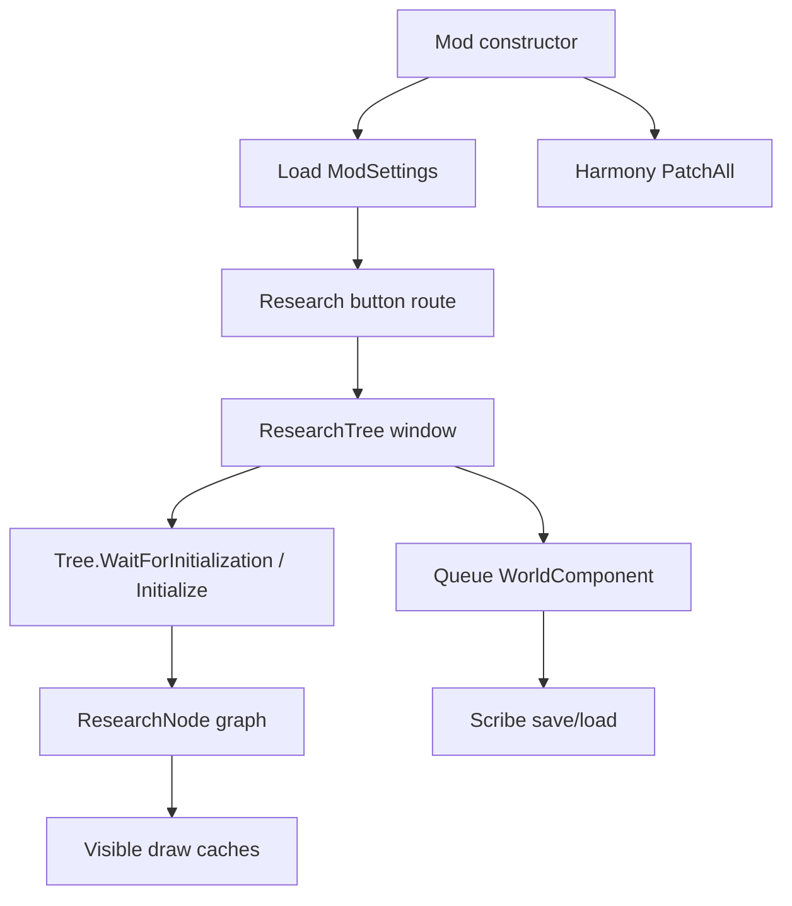

# Runtime Architecture

## 层次

1. Def 层：`1.6/Defs` 和 `1.6/Patches` 声明主按钮和兼容按钮。
2. Mod 启动层：`FluffyResearchTreeMod` 初始化设置、Harmony patch 和版本显示。
3. UI 层：`MainTabWindow_ResearchTree`、设置窗口、标签选择窗口、信息卡窗口。
4. 图模型层：`Tree`、`Node`、`ResearchNode`、`DummyNode`、`Edge`。
5. 队列状态层：`Queue : WorldComponent`。
6. 兼容层：`Assets` 和 `Patches/*`。
7. 工具层：`FastGUI`、`TooltipHandler_Modified`、`Logging`、extensions。

## 状态流

## 关键全局状态

- `FluffyResearchTreeMod.instance`：设置和写盘入口。
- `Tree.Initialized`、`Tree.FirstLoadDone`、`Tree.NoTabsSelected`：树生命周期。
- `Assets.RefreshResearch`：UI 刷新信号。
- `Queue._instance`：世界队列实例。
- `MainTabWindow_ResearchTree.Instance`：窗口操作入口。

> [!note]
> 这是 RimWorld mod，部分全局状态是对游戏 API 的自然适配。质量重点不是完全去全局，而是让全局边界稳定、可重建、可验证。

## 相关笔记

- [[Code Module Map]]
- [[Harmony Patch Surface]]
- [[Verification Guide]]
