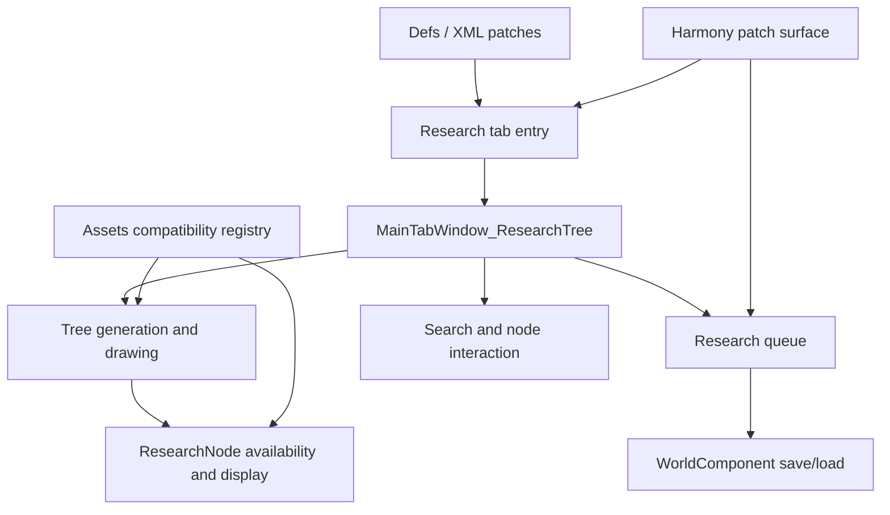

# ResearchTree Knowledge Base

这是基于当前代码整理的 Obsidian 知识库入口。它按玩法路径组织代码：从研究按钮入口，到研究树生成、节点交互、队列、设置、兼容补丁，再到验证清单。

> [!summary]
> 模组的核心目标是替换/增强 RimWorld 研究入口，提供可导航的研究树、研究队列、节点详情、标签过滤，并通过 Harmony 与 Def patch 保持对原版研究窗口和常见研究 UI 模组的兼容。

## 导航

- [[Gameplay MOC]]：按玩家行为路径理解功能。
- [[Architecture MOC]]：按运行时边界、数据流和模块职责理解代码。
- [[Verification Guide]]：构建、静态检查、单测和游戏内回归。
- [[Code Module Map]]：核心 C# 文件职责索引。
- [[Compatibility]]：外部 mod 兼容面。

## 快速读图

## 当前代码状态

- 主项目：`Source/ResearchTree/FluffyResearchTree.csproj`
- 测试项目：`Source/ResearchTree.Tests/ResearchTree.Tests.csproj`
- 静态检查：`Directory.Build.props`
- 游戏内手测：`Docs/ManualTestPlan.md`

## 维护约定

- 新增玩法时，先更新 [[Gameplay MOC]]，再补对应架构页。
- 改 Harmony patch 时，同时更新 [[Harmony Patch Surface]] 和 [[Verification Guide]]。
- 改研究标签或设置逻辑时，同时更新 [[Settings and Tab Filtering]]、[[ResearchTabSelection]] 相关测试说明。
